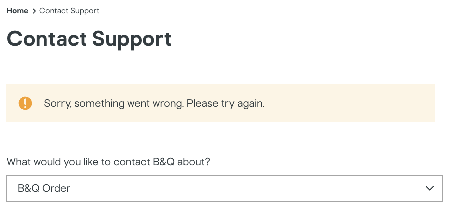
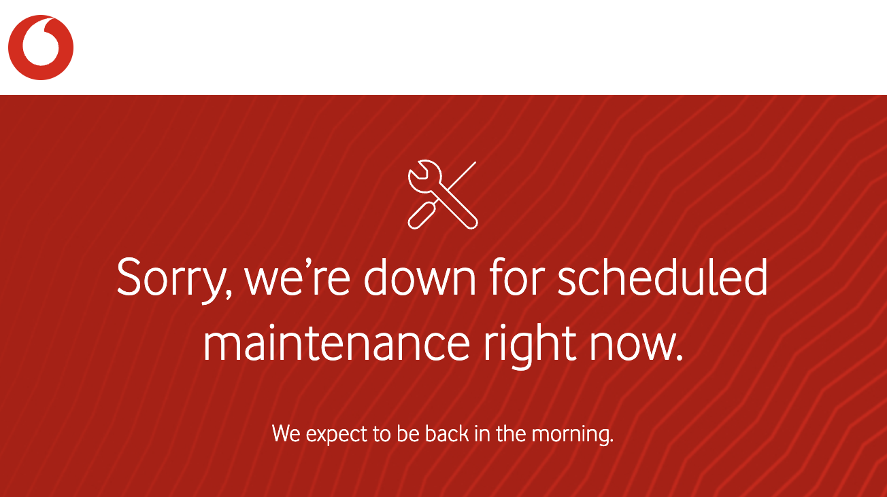
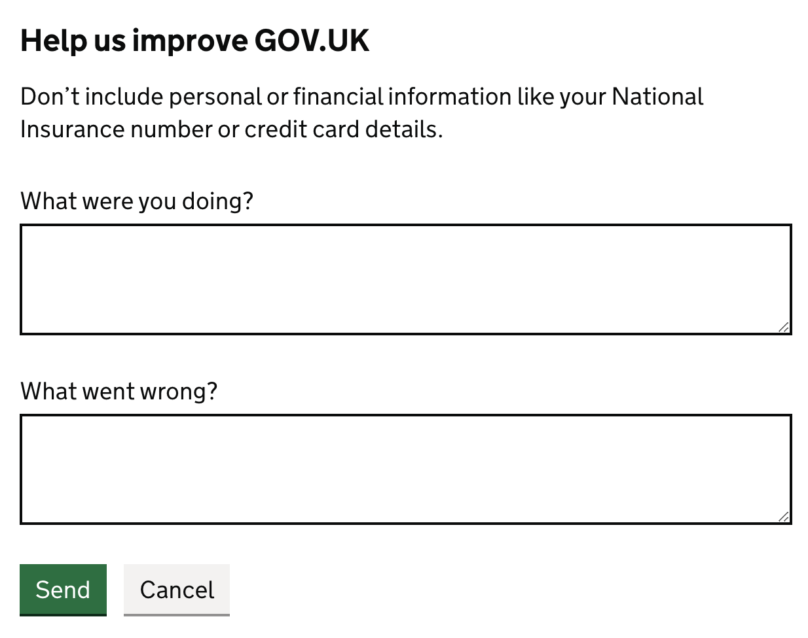

Contact forms are almost always worse for users than just putting an email on your website. I explore why they’re terrible, why you’ve done it anyway, and what to do about it.

## Why your contact form sucks

### Your contact form is completely broken

It’s remarkable how many contact forms are just straight-up broken. A WordPress upgrade here, a change to your CRM there, and your contact form silently breaks.

At time of writing, B&Q’s contact form just plainly doesn’t work[^1]. I am fairly amazed that a retailer with [revenues in the billions](https://en.wikipedia.org/wiki/B%26Q) doesn’t notice written queries have stopped coming in.

(as a side note: your form should have [better error messages](https://wix-ux.com/when-life-gives-you-lemons-write-better-error-messages-46c5223e1a2f). The error above gives the user no way out, given that trying again would not help)

This is not an isolated incident. I’ve been stung by broken contact forms on all kinds of websites, from many other big and small organisations. [AWS’s abuse contact form has been broken for months](https://news.ycombinator.com/item?id=38554522). And here’s a particularly gnarly example from [Elastoplast](https://www.elastoplast.co.uk/pages/contact), one of the largest plaster brands in the UK:

### Your contact form is broken for some users

Axa, an insurer with almost [a trillion euros of assets under management](https://www.axa-im.com/who-we-are/axa-im-numbers), offers [a contact form](https://customer.axa.co.uk/contact/email-general/) that looks like it’s time travelled from the early 2000s. Unfortunately, it doesn’t seem like that time has made it work better: it incorrectly rejects some valid emails[^2] and doesn’t show all the relevant Axa products.

Vodafone, a major UK mobile network, has [a form to report devices lost and stolen](https://www.vodafone.co.uk/webcenter/portal/myvodafone/lostandstolen). However, their site is frequently unavailable for maintenance overnight. I can’t imagine how frustrating having a phone stolen, only to try to report it and be presented with this:

Finally, a lot of contact forms do not meet basic web accessibility standards, making it hard for assistive technology users to properly complete them. For example, [Virgin Mobile’s complaint page](https://www.virginmedia.com/help/virgin-mobile-complaint) is nearly unnavigable by keyboard due to hiding any kind of selection indicators.

### Your contact form takes ages to fill out

I’m not sure how it’s been achieved, but the [UK’s Charity Commission’s complaints form](https://forms.charitycommission.gov.uk/Complaints-to-the-Charity-Commission-for-England-and-Wales/) takes about 6-7 seconds to load every single page! It offers no indication of progress, and you have to get through 11 pages to complete it.

At this rate, you spend **75 seconds** just waiting for pages in the form to load.

And that’s not including the time to answer the questions asked - or even processing some of them. Don’t worry, you’ll get to review each one carefully because none of them have [autocomplete attributes](https://developer.mozilla.org/en-US/docs/Web/HTML/Attributes/autocomplete) set.

You’ll also have to read through all the options in this monstrosity of a dropdown - which is helpfully not grouped or sorted in any coherent way:

(Additionally, this question doesn’t make sense to ask in the first place. The complaint is about a service by the Charity Commission, after answering ‘No’ to the question ‘Does your question or query relate to a specific registered charity?’)

### Your contact form asks for irrelevant personal information

National Grid has [contact](https://www.nationalgrid.co.uk/contact-us/contacting-national-grid-electricity-distribution/general-contact-enquiries) and [feedback](https://www.nationalgrid.co.uk/contact-us/contacting-national-grid-electricity-distribution/feedback-and-compliments) forms.[^3] I might want to give them some minor feedback like ‘hey this link on your site is broken’, however I then need to figure out whether I really want to provide all my personal details to do this - like my home address and phone number (or at least make up something that looks plausible).

I’ve also seen some complaints forms asking for more sensitive data, like date of birth or copies of ID documents. Sometimes this is despite them not holding this information in the first place, so they’re not comparing it to what they have on record as a security measure.[^4]

You do need to collect some contact details, but do you really need **three** different contact methods to respond to some off-hand feedback? Other things you probably don’t actually need on a general contact form include [title](https://writefulcopy.com/blog/why-title-should-not-be-a-required-field-on-online-forms), job function, company size, and [landline](https://www.bbc.co.uk/news/business-56831212) number.

This unnecessarily increases the risk of my data being stolen and used for identity fraud. For less trustworthy organisations, this also directly increases the chance I get spam - so I either don’t submit the form, or [make up data](https://www.reddit.com/r/CasualUK/comments/1b6up7p/does_anyone_actually_give_their_email_address/).

### Your contact form is less useful for customers

Email allows customers to create drafts, schedule messages, and easily keep a record of what’s been said. It also often integrates into their workflows more easily, for example the ability to [snooze emails](https://support.google.com/mail/answer/7622010) to chase up on them later.

Your form likely doesn’t have any of these features. In fact, even if it’s fully working users often don’t get any form of confirmation they can refer back to later, let alone a confirmation that contains all the details they submitted.

I’m not certain there is malicious intent behind it, but I have experienced several companies ‘accidentally’ losing form submissions, only to mysteriously find them again once I pull up copies of the form I saved a screenshot of. If you’re forcing your customers to do this, you’re doing it wrong.

### Your contact form is wasting your resources

It takes time and energy to build and maintain a contact form properly. It almost always gets routed to an email behind the scenes (or a system that accepts email), so skip the middleman and put up the email address!

It also can mean that customers contacting you can’t remember what their original message was about. I’ve experienced getting a response from an organisation and then having to ask them what the original query was about - had this been an email in the first place this could have been avoided.

### Your contact form is irritating in other ways

There are probably hundreds of ways you could set up your contact form to be maximally irritating, and I can’t cover them all here. I’ll leave you with one final example that doesn’t fit into the categories above though.

Sainsbury’s has a [contact form](https://help.sainsburys.co.uk/help/contact-us) that forces you to navigate down a long options tree. Only to open a modal and ask you to select the topic again. They then present the tiniest form window ever, which makes it near impossible to fill out:

## Why you’ve done this, and what to do instead

Beyond just ‘it’s what we’ve always done’, there are a few reasons you might think a contact form is a good idea. Here we’ll go through some of them and what you might do instead.

### To collect structured data that speeds up resolving problems

You might want to use a contact form to collect structured data, so it saves you time processing requests. For example, making sure the customer provides the right identifiers for you to find them on your systems quickly, or automatically assigning queries to the right teams.

This _can_ be okay in some circumstances. Amazon does this well: it shows you the recent items you’ve purchased and also allows you to completely self-serve common customer service workflows (like requesting a return) - while still allowing you to speak to a human fairly easily.

However, unless you’ve got an excellent customer service portal (you probably don’t), you should just stick with an email for general contact purposes.

To make sure you have the right details, just set up a sensible auto-reply. Here’s a good example from GP at hand:[^5]

You could also encourage users to provide the right details upfront by using [mailto links](https://mailtolinkgenerator.com/) with appropriate parameters, such as [support@example.com](mailto:support@example.com?subject=Support%20query%20based%20on%20webpage%20'Inviting%20other%20users'&body=Related%20support%20page%3A%20https%3A%2F%2Fexample.com%2Fhelp%2Finviting-other-users%0AFull%20name%3A%20%0AAccount%20number%20(if%20relevant)%3A%20%0A%0A%5BYour%20support%20query%20here%5D).[^mailto_credit]

Next, before automating assigning queries to the right teams, consider whether you need to do this: I’ve seen very small teams try to justify ‘a contact form will help us categorise emails’ when they receive two emails a day, or they all go to the same person anyways.

If you really do need to automate assigning emails, take a look at platforms like [Zendesk and their AI systems](https://support.zendesk.com/hc/en-us/articles/5608652527386-Getting-started-with-Zendesk-AI-and-Advanced-AI#h_01HH0BTYYBV6ETWHG8779M9Y8C) - this kind of thing is exactly what [LLMs](https://en.wikipedia.org/wiki/Large_language_model) thrive at (or often just [regular expressions](https://developer.mozilla.org/en-US/docs/Web/JavaScript/Guide/Regular_expressions) will get you far enough).

### You want people to contact you, and think your form will lower the barrier

Empirically, this doesn’t hold up. I previously thought this was true, but I’ve since seen at 3 different organisations who’ve made the switch that this doesn’t seem to be the case - i.e. they get the same number of genuine contacts by listing an email as having a contact form. I’d love to rigorously analyse and publish the data on this to help convince others.

One category where this might not be true by default is for very ‘low-effort’ feedback forms. I think this can probably be mitigated by making it clear that you’re friendly and would be happy to receive informal emails.

The other category where I think this might be more likely to lower the barrier is where people prefer to be anonymous. For example, someone who might not be public about their sexual orientation might not want to have related comments so easily linked back to them, but still want to give feedback on some article. The UK Government website, GOV.UK, has a delightfully simple example that works well for collecting anonymous feedback:

### You’re worried you’ll get spam if you list an email online

Surprisingly, not really. I found we often ended up getting _less_ spam compared to WordPress forms - there might be something about it being easier to submit anonymous forms with rubbish, compared to actually sending emails with decent enough reputation to get past today's spam filters.

If you really worry about this, you can [obfuscate your email from spam bots](https://superuser.com/questions/235937/does-e-mail-address-obfuscation-actually-work). But I think this is usually wasted time given just how rare this kind of email spam is, and how good spam filters have gotten. Plus this risks you messing this up and breaking something.

### You want to manage messages as a team

You can do this with email! Hook up a [shared mailbox](https://support.microsoft.com/en-gb/office/open-and-use-a-shared-mailbox-in-outlook-d94a8e9e-21f1-4240-808b-de9c9c088afd), [collaborative inbox](https://support.google.com/a/users/answer/167430), or one of the many off-the-shelf customer service solutions like [Zendesk](https://www.zendesk.co.uk/service/ticketing-system/customer-service-email-management-software/), [Zoho Desk](https://www.zoho.com/desk/), [Freshdesk](https://www.freshworks.com/freshdesk/), [Request Tracker](https://github.com/bestpractical/rt)[^6], [Zammad](https://zammad.org/), [osTicket](https://osticket.com/) or [FreeScout](https://freescout.net/) to your email.

### You think email isn’t secure enough

Email used to be very insecure because it wasn’t encrypted.[^7] This meant that people between mail servers could read the contents of messages.

However, unless you’ve done something weird with your email setup, it’ll probably be encrypted securely like [99% of other email traffic](https://transparencyreport.google.com/safer-email/overview) is in 2024.

In theory, your customer might be using an email provider that doesn’t support encryption - which could lead them to sending something to you insecurely and putting them at risk. I think most organisations can accept this risk given how rare this is, given that this is on the customer’s end. For what it’s worth, the UK’s National Cyber Security Centre [is happy to list a contact email for themselves](https://www.ncsc.gov.uk/organisation/ncsc).

Another question to ask yourself if you don’t list an email for this reason: do you respond via email after people contact you?

### You think email isn't accessible to assistive technology users

I've heard the claim that you need a contact form to be compliant with some common accessibility standard - this is simply not true. If you don't beleive me, try and actually find this rule.[^8]

Listing an email is almost certainly easier to parse and understand than your contact form.

### You don't want people to fill in your form

Yeah - this is one I'm not really here to help you with.

There are some organisations that intentionally want their form to be difficult to complete - perhaps it’s a regulatory requirement that you don’t really want to comply with. If you’re doing this, you should probably feel bad.

It’s unclear how intentional this is, but in this vein Meta (Facebook) makes it very difficult to contact them about data protection matters. Some charities [have already highlighted](https://noyb.eu/en/no-bullsht-opt-out-free-noyb-tool-quick-and-broad-facebook-objections) that Meta’s forms seem to be particularly difficult to find, and difficult to complete. My own experiences with this process have been complex and drawn out, having been referred to several different broken forms.

Regulators should be doing a better job ensuring they are setting the bar appropriately in these cases, in a way that rewards actors who are complying with both the letter and spirit of laws or regulations.

## Conclusion

Contact forms are hard to get right, and often just a worse experience for everyone involved. Go forth and remove your contact form and list your email on your website now!

[^1]: As in, it’s impossible to submit from the website - the error appears when submitting. Inspecting the network requests suggests this error is because a ‘title’ property is missing: likely some mismatch between the backend and the frontend (there is no title field on the frontend). Yes, these problems happen in software development from time to time: but there’s no need to incur this if email already ‘just works’.

[^2]: `test+test@example.com`, `tést@example.com` and `test@éxample.com` are all valid emails as per [RFC 6532](https://www.rfc-editor.org/rfc/rfc6532), but are all rejected by this form

[^3]: As a fun side bonus, if you make a single mistake on this form it deletes everything and forces you to start from scratch. For example, if you format your phone number ‘wrong’, your entire message you typed up is wiped.

[^4]: I don't think people's birthdays should be a security measure, but unfortunately it seems to be the world we live in. I'll have to explore this in another rant.

[^5]: It could probably place this a bit more prominently by cutting some of the other stuff, but on the whole the message is fairly clear and not an unreasonable length.

[^mailto_credit]: Thanks to foreigner for [the recommendation](https://news.ycombinator.com/item?id=40258213).

[^6]: Thanks to amluto for [the recommendation](https://news.ycombinator.com/item?id=40257941).

[^7]: There are also other email security risks, such as email spoofing (solvable with [DMARC](https://en.wikipedia.org/wiki/DMARC)!). But on the whole, the email security risk seems overblown (especially compared to 'crappy WordPress form' security risk).

[^8]: Further examples that would seem to suggest that this is not necessary is that the following organisations list an email to contact them: [Equality and Human Rights Commission](https://www.equalityhumanrights.com/contact-us) (the public body responsible for disability rights), [Scope](https://www.scope.org.uk/contact-us/) (a major disability equality charity) and [AbilityNet](https://abilitynet.org.uk/how-contact-us) (a charity building assistive technologies).
