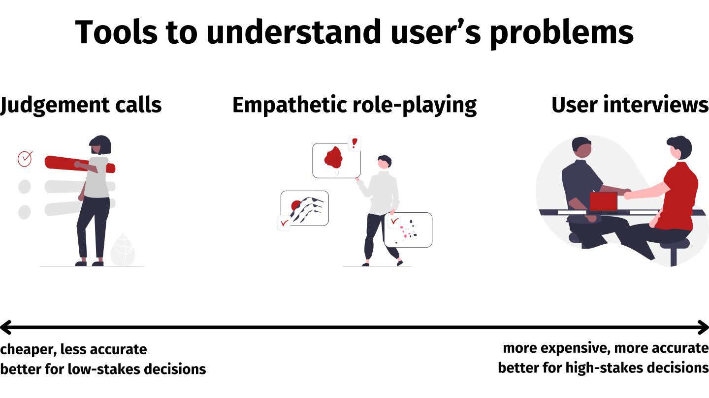

User interviews are the gold standard for understanding your users and their problems. However, interviews are expensive and some organisations make it difficult to do them. This article introduces *empathetic role-playing*, a less powerful but cheaper alternative.

This isn’t a new technique! It’s just a thing I’ve seen some of the best product people I’ve worked with at Palantir and Starling Bank do. I hadn't seen a description of it written down anywhere, and wanted to fix that.

## What is empathetic role-playing?

Empathetic role-playing involves simulating a scenario from the perspective of a user. It’s a bit of a cross between [empathy mapping](https://www.nngroup.com/articles/empathy-mapping/), [journey mapping](https://www.nngroup.com/articles/journey-mapping-101/), and [role-playing](https://servicedesigntools.org/tools/role-playing).

The process is:

1. Imagine you are a customer who has a problem.
2. Write down what you would think and feel in this situation.
3. Identify what you’d do next.
4. Imagine taking that step, and what is the likely result?
5. Repeat steps 2-4 until the problem is solved or you reach a dead end.

### When is empathetic role-playing appropriate?

Empathetic role-playing is a technique for product managers to better understand user problems. Use it where you might want to use a user interview, but don't have the resources or capacity.

It's likely to lead to best results if:

* You’re deeply familiar with the people you’re trying to help. It’s ideal if you are in the target demographic yourself.
* You have strong empathy skills.[^1]

### How to make the most of empathetic role-playing

Don’t just simulate the [happy path](https://en.wikipedia.org/wiki/Happy_path)! People have complex lives - perhaps there are constraints such as:

- they have limited time or money to pursue a solution
- they work a job so aren’t free to call during business hours
- they have social anxiety and don’t want to talk to a stranger about their problem

To make things even more realistic, do step 4 for real where possible. For example, if this is setting up a free account with another provider, go through that flow.

## Deciding between tools

In general, you should base your decision of what tool to use on these two factors:

* **How costly is each option?** Consider staff time setting up and running interviews, incentives given to customers, and other costs (for example, political capital in some organisations).
* **What is the expected benefit from each option?** This is usually by avoiding spending money building the wrong product, which is very expensive. You also need to evaluate the likelihood of discovering that you were building the wrong thing. If you haven’t done user interviews recently, you probably overestimate how well you know your customers, and undervalue this.

You don’t need to commit to one tool from the outset. For example, you might start with empathetic role-playing. Then, you discover a critical uncertainty and switch to user interviewing to resolve that uncertainty.

## Concluding

Empathetic role-playing is a useful technique for occasions to better understand user problems where user interviews aren't practical. Try putting it into practice in your next project and see how it goes!

[^1]:
    I haven’t found excellent resources on developing empathy as a skill. Many articles on this are very vague. [This article](https://mcc.gse.harvard.edu/resources-for-educators/how-build-empathy-strengthen-school-community) seems to be one of the better ones.

    An idea I have for a training program on this is a series of flashcards, each with a description of some people in a scenario. The learner then has to guess how people are feeling, what they might do next and why. Large language models might be quite good at this due to how they’re trained to predict what will happen next. They therefore might be able to generate scenarios and grade answers well.
